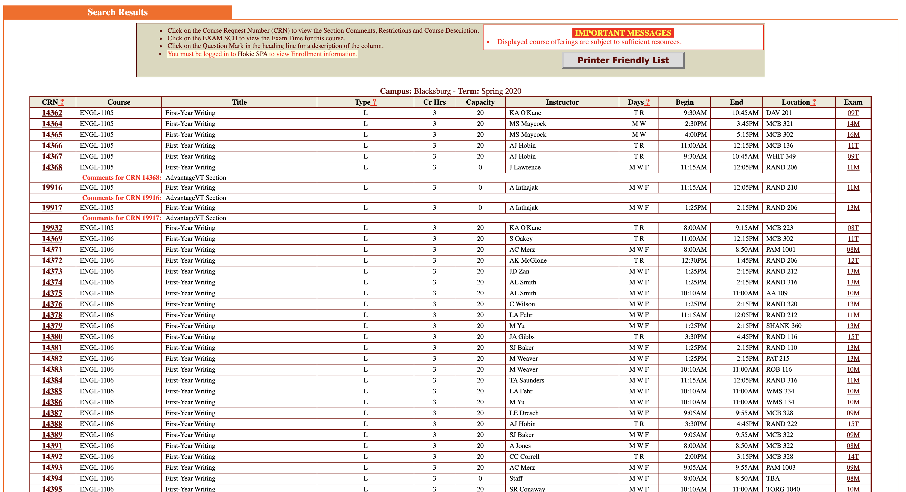
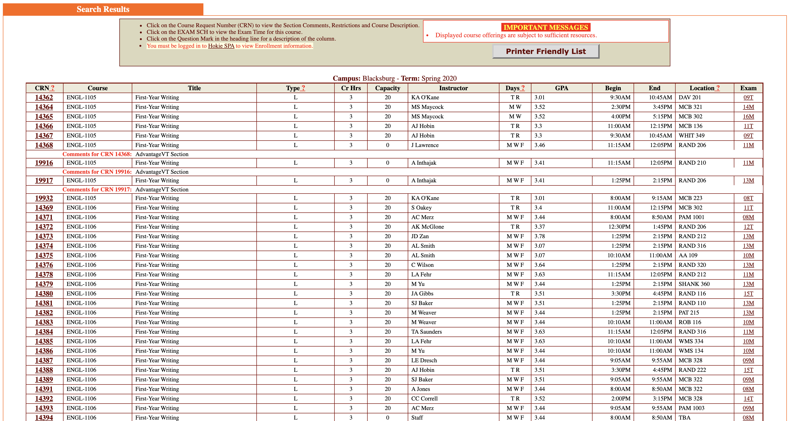

# VTGPA
VTGPA is a Chrome Extension to display corresponding GPA data on the Virginia Tech Timetable of classes.
## Description
Using a Virginia Tech grade report generated from the University DataCommons, the CSV is parsed and turned into a RESTful web-service using Java and Spring. The Javascript is responsible for scraping each row of the timetable and performing a GET request on the server. The GPA data is then calculated specific to the instructor and course. A new column is added on the timetable and the relevant data is written in.
## Images

## Notes
This project was completed in 24 hours and is fairly rough. The backend needs a major rewrite for efficiency. Stay tuned for  updates soon.

## Members
Matthew Betsill
Ryan Bierly
Ryan Marcus
Pranav Chavvakula

## Awards
Virginia Tech: SheHacks 2020
* 1st place (out of 70 teams)

## Technology
### Front End
* Javascript  
  * JQuery  
* HTML/CSS
## Back End
* Java  
* Spring  
   * Maven
## Deployment
* Heroku

 
